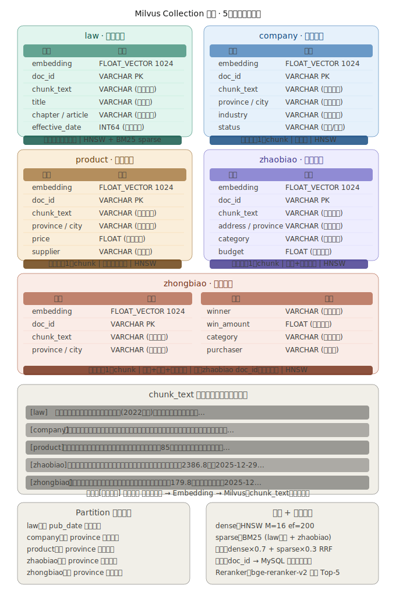

## Milvus 入库设计方案

### 核心设计原则

针对这5类数据，**不是所有字段都需要入向量库**。Milvus 承担的职责只有两件事：**向量检索** + **携带关键标量字段做过滤**。其余结构化字段放 MySQL，检索后根据 `doc_id` 回表补全。

------

### 一、Collection 设计：5表 → 5个独立 Collection数据结构非常清晰，下面我来给出完整的分析方案。---

## 详细设计说明

### 一、核心判断原则

**设计表：**



看完这5张表，得出以下结论：

**哪些字段入 Milvus**：只存 embedding + 检索时需要的标量过滤字段 + `chunk_text` 供召回后直接展示。其余的 `legal_rep`、`reg_number`、`taxpayer_id`、`contact_phone`、`email` 等结构化详情全部留在 MySQL，用 `doc_id` 回表取。

**Milvus 不是数据库**，它不适合存"全量字段"——字段越多，内存压力越大，而且这些详情在 RAG 场景中根本不需要参与向量检索。

------

### 二、各表入库策略差异

**law（政策法规）** 是唯一需要做真正切片的表。`content` 字段是完整法规全文，必须按条款/段落切片，每个 chunk 约 512 tokens，overlap 约 50 tokens。`chapter` 和 `article` 字段从 metadata 提取后作为标量字段，方便检索时引用来源（"第三十五条"）。这类数据同时建 BM25 稀疏索引，因为用户经常用关键词（"招标人"、"评标委员会"）查询，纯向量检索在专业术语上有明显缺陷。

**company、product、zhaobiao、zhongbiao** 这四类，每条记录结构紧凑，核心信息量有限，适合整条记录作为一个 chunk 处理，不做切片。

------

### 三、chunk_text 的拼接方式

这是入库质量的关键，不能直接把原始字段做 embedding，要构造语义完整的描述性文本：

```python
# company
def build_company_chunk(row):
    return (
        f"{row['company_name']}，{row['company_type']}，"
        f"位于{row['province']}{row['city']}，"
        f"行业：{row['industry']}，状态：{row['status']}，"
        f"主营：{row['business_scope'][:100]}"
    )

# zhaobiao
def build_zhaobiao_chunk(row):
    budget = f"预算{row['budget']}万元" if row['budget'] != '未知' else ""
    return (
        f"招标公告：{row['title']}，"
        f"采购方：{row['purchaser']}，代理：{row['agency']}，"
        f"{row['address']}，{budget}，发布：{row['pub_date']}"
    )
```

这样构造的文本语义丰富，bge-m3 才能给出高质量的 embedding。

------

### 四、标量字段的选择逻辑

以下字段进入 Milvus 做过滤，选取依据是"查询时高频用于缩小范围"：

| 表        | 入 Milvus 的过滤字段                                         | 理由                         |
| --------- | ------------------------------------------------------------ | ---------------------------- |
| law       | `title`、`effective_date`                                    | 按法规名+时效期过滤          |
| company   | `province`、`city`、`industry`、`status`                     | 用户常问某省某行业的存续企业 |
| product   | `province`、`city`、`price`                                  | 地域+价格范围过滤            |
| zhaobiao  | `address`、`category`、`budget`、`pub_date`                  | 地域+类别+预算+时间          |
| zhongbiao | `province`、`city`、`category`、`win_amount`、`winner`、`purchaser` | 跨表关联查询核心字段         |

不入 Milvus 的字段（留在 MySQL）：`reg_number`、`taxpayer_id`、`credit_code`、`contact_phone`、`email`、`project_num`、`agency` 联系方式等，这些都是展示型字段，不参与语义检索。

------

### 五、zhaobiao 与 zhongbiao 的跨表关联

这两张表有天然的关联关系（招标→中标），建议在 zhongbiao 的 Milvus Collection 中额外存一个 `zhaobiao_doc_id` 字段，这样当用户问"这个项目的中标结果是什么"时，可以先检索 zhaobiao，拿到 `doc_id` 后直接用 `expr` 过滤 zhongbiao Collection 做精确查询，而不是再走一次向量检索。

------

### 六、Partition 分区建议

5个 Collection 全部按 `province` 地域分区（law 按年份）。这样当用户的问题带有明确地域意图时（"广东省的招标项目"），可以只扫描对应分区，大幅降低检索延迟，在数据量达到百万级时效果显著。