# 完整架构方案详解

## 整体架构



## RAG查询链路



### 一、接入层（前端）

基于 Vue3 + TypeScript + Element Plus，按模块划分：

**核心页面模块**：智能问答（流式对话/来源引用/反馈）、系统管理（用户/租户/权限/知识库管理（文件上传/分类/状态））、数据分析（查询热词/准确率趋势）。

**技术选型补充**：Pinia 管理全局状态，`EventSource` 接收 SSE 流式响应，`pdfjs-dist` 预览文档，`echarts` 渲染统计图表。

------

### 二、网关层

Nginx 作为统一入口，负责 HTTPS 终止、静态资源服务和反向代理。FastAPI 承担 API 网关职责，实现：JWT 无状态鉴权 + RBAC 多角色权限控制、每 IP/用户的滑动窗口限流（Redis 计数）、请求日志中间件、统一异常格式。

------

### 三、应用层（FastAPI 微服务）

按领域拆分为独立 Router 模块，部署可以单体起步，后续拆分为微服务：

| 服务          | 职责                                     |
| ------------- | ---------------------------------------- |
| 问答服务      | 调用 RAG Pipeline，SSE 流式返回          |
| 文档服务      | 接收上传，异步触发 Celery 解析任务       |
| 知识库管理    | 多知识库隔离，权限管理                   |
| 用户/租户服务 | 多租户数据隔离（MySQL Schema 级别）      |
| 历史记录服务  | 会话持久化、用户反馈收集（用于后续评估） |
| 监控服务      | 暴露 `/metrics` 给 Prometheus            |

**异步处理**：Celery + RabbitMQ 处理文档解析和向量入库任务，避免阻塞主线程。

------

### 四、AI 引擎层（核心）

这是整个平台的技术核心，以 LangChain 编排流程，LlamaIndex 管理索引：

**文档处理流水线**

```
上传 → Unstructured 解析 → 递归语义切片（512 tokens，20% 重叠）
     → 表格/图片单独处理 → 元数据打标（来源/时间/类型）
     → Embedding → 写入 Milvus + Elasticsearch
```

**RAG 增强策略**（分阶段上线）：

首期上线混合检索（向量 + BM25）和 Reranker。二期引入 HyDE（用 LLM 先生成假设答案再检索）和 Query 改写。三期结合 GraphRAG 处理政策类文档的实体关系。

**LLM 路由策略**：敏感/私有数据走本地 vLLM（Qwen-7B/14B），通用问答走 Qwen API（成本低、质量高）。通过 LangChain 的 `LLMRouter` 根据知识库标签自动路由。

**Embedding 模型**：线上用阿里 `text-embedding-v3`（API 调用，免维护），私有化场景用 `BAAI/bge-large-zh-v1.5` 本地 vLLM 托管。

------

### 五、数据层

**Milvus**：每个知识库对应一个 Collection，使用 HNSW 索引，字段包含 `chunk_text`、`embedding`、`doc_id`、`knowledge_base_id`、`metadata`（JSON）。开启混合检索（dense + sparse）。

**MySQL**：存储所有业务元数据，包括用户表、知识库表、文档表、Chunk 映射表、会话表、问答记录表。使用 SQLAlchemy 2.0 异步 ORM。

**Redis**：两类用途，一是语义缓存（将高频问题的 Embedding 和答案存储，TTL 1小时），二是 Celery Broker 和运行时缓存（限流计数器、Session）。

**MinIO**：本地化对象存储，存原始文档文件；生产环境可替换为阿里 OSS，接口不变。

------

### 六、基础设施

**uv:** 使用uv作为整个项目的包管理工具

**Docker Compose**（开发/小规模生产）：

```yaml
services: nginx, frontend, api-gateway, rag-service,
          celery-worker, milvus, mysql, redis, minio,
          rabbitmq, prometheus, grafana, elasticsearch,uv
```

**扩展至 K8s**（大规模生产）：API 服务 HPA 自动扩缩容，vLLM 挂 GPU 节点，Milvus 使用 Helm Chart 部署集群版。

**可观测性三件套**：Prometheus + Grafana 监控（QPS/延迟/Token 消耗），ELK Stack 日志聚合，Langfuse 追踪每次 RAG 链路的召回质量和 LLM 响应。

------

### 七、分阶段交付建议

**Phase 1（MVP）**：单知识库 + 基础 RAG + Qwen API + 前端问答界面 + Docker Compose 部署。

**Phase 2（增强）**：多知识库多租户 + 混合检索 + Reranker + 文档管理界面 + 监控接入。

**Phase 3（生产级）**：本地 vLLM 部署 + GraphRAG + 语义缓存 + 评估体系（RAGAS 自动评分）+ K8s 迁移。
